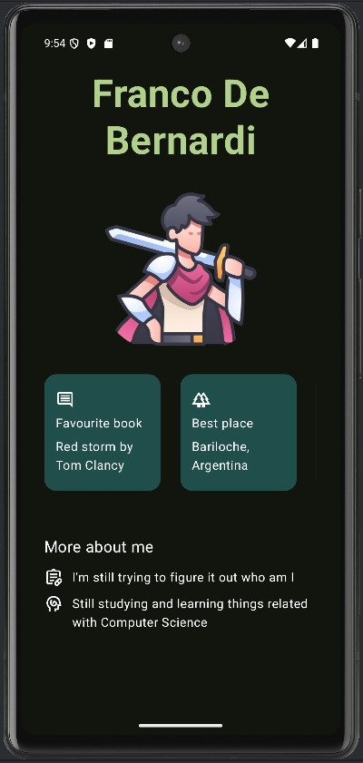

# Presentation card app

Basic Android app using Jetpack Compose & Kotlin as the final project for Unit 1 in the [Basics aspects of Android with Compose](https://developer.android.com/courses/android-basics-compose/course?hl=es-419 "Android course by Google")

## Result

Here's the app

